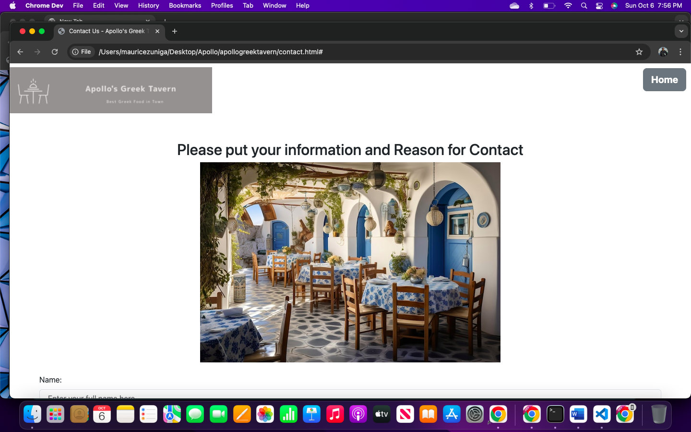

# Apollogreektavern

Tech used : HTML, CSS , Javascript, Bootstrap.


## Description

* Creating a Greek restaurant webpage in which includes HTML, CSS and JavaScript.

* Bootstrap is used for the CSS framework. 

* Images are from google.com 

* As a customer, one is able scroll through the website to view all the different foods provided.

* As a customer, one is able to submit an application for catering services which directs to local storage 

* An error message appears if the text box is left empty or not in its correct format, such as email not containing an @


## Roadmap

* For future releases we plan to include an order option online for customers to place food orders. 


## Contributing

* If you would like to contribute to this project, please follow these steps:

``` Fork the repository. 
    
```Create a new branch:
    git checkout -b htmlbranch

    Make your changes and commit them:
    git commit -m "Added some features"

    Push to the branch:
    git push origin htmlbranch
    Open a pull request. 
```

## Credits

Collabarators : 

Kavi - gitkaviyarasi
Stephany - stephanyxpal
Maurice - mauricek12d
Denzel - 

## Assets

The following image demonstrates the web application's appearance:





## Link
* Deployed: https://gitkaviyarasi.github.io/apollogreektavern/
* Github repo:  https://github.com/gitkaviyarasi/apollogreektavern
